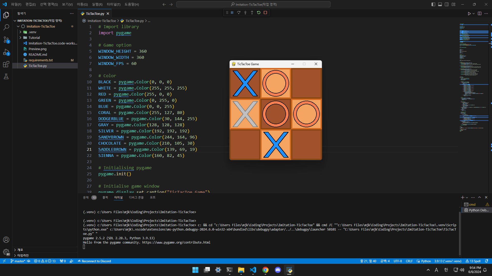

# 💻 Imitation-TicTacToe

## Preview

## Introduction

> 파이썬 Pygame 엔진을 사용해 틱택토 게임을 간단히 구현해 보자.

## Requirements

> pip install -r [requirements.txt](./requirements.txt)